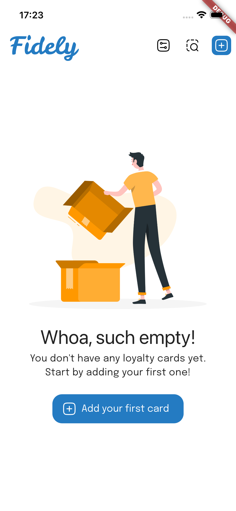
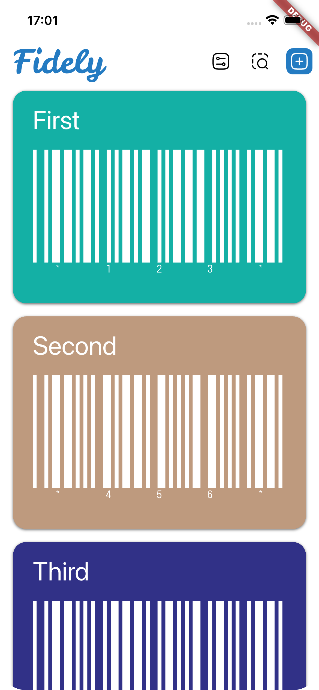
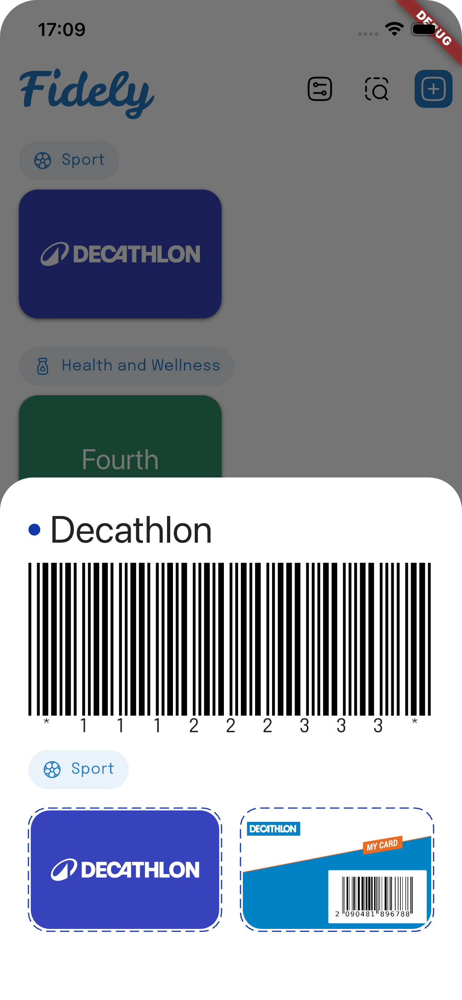
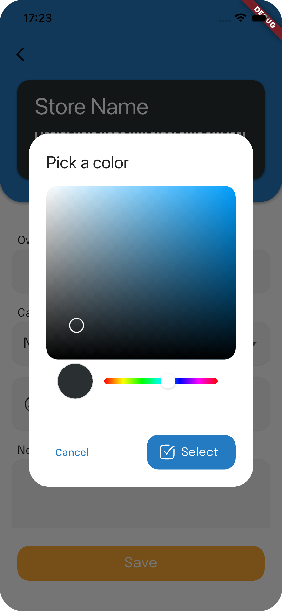
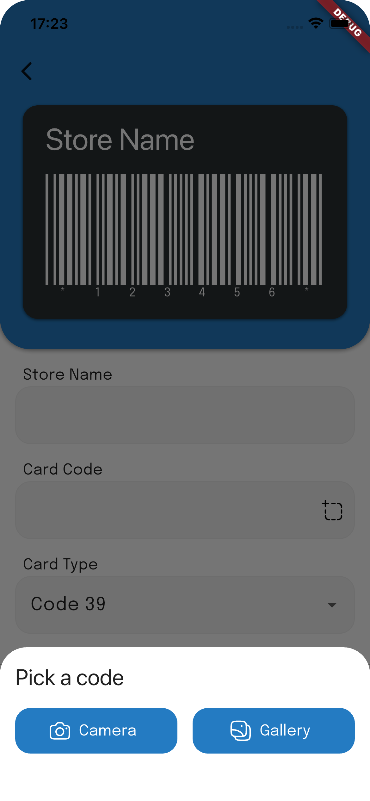
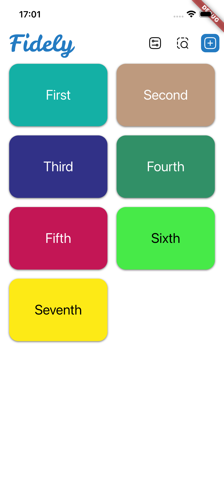
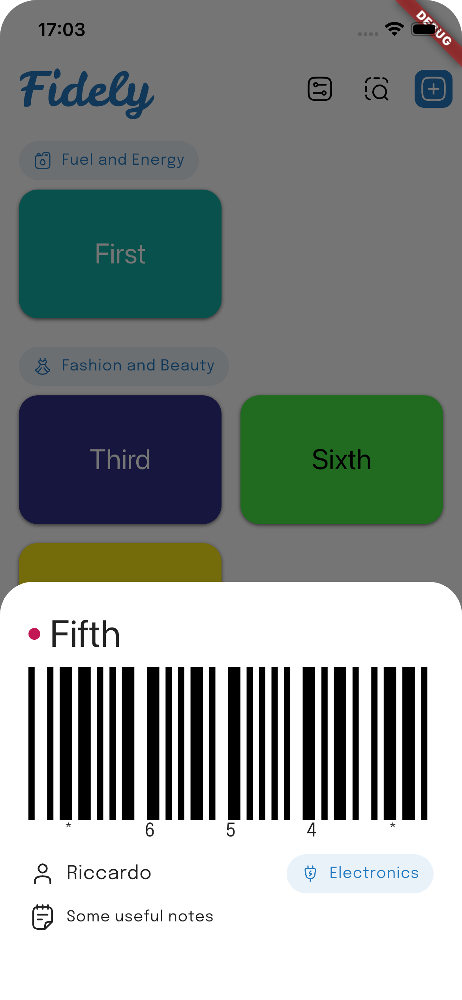
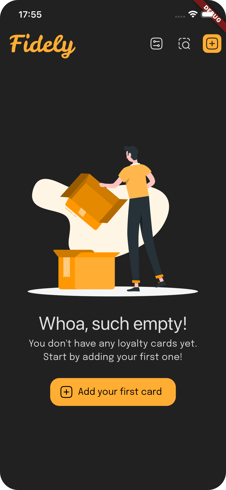
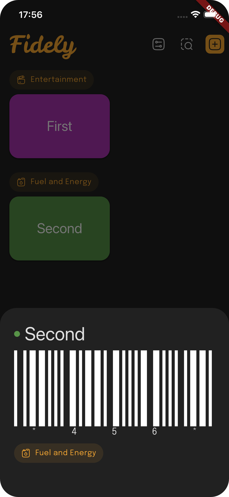
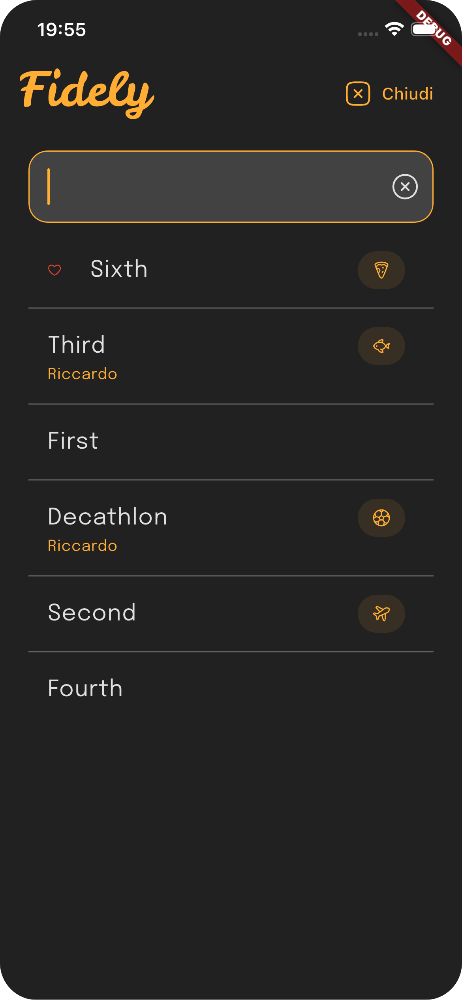

**Fidely is an open-source, free and offline loyalty card wallet.**

<!--  -->

## Screenshots

## Features
- Manage your virtual wallet without any internet connection
- Scan codes via front or rear camera
- Scan codes via gallery
- Attach front and back photos to cards
- Customize cards aspect
- Dark and light modes
- Multiple languages support ([see below](#supported-languages))
- Multiple codes format support ([see below](#codes-format-support))
 
## Why choose Fidely?
- 💸 Free: no fees, no subscriptions
- 📺 No paid content or ads: completely free and ad-free experience
- 📡 Offline: all data is stored on your device
- 🤐 Privacy first: no data shared with any third party

### Back up your device! 💾
Your card data is stored exclusively locally on your device.
It is recommended to regularly back up your device to prevent accidental data loss.

## Supported languages
- English
- French
- Spanish
- Italian

All translations were generated by AI. Feel free to suggest better _"human-made"_ translations! 😉

## Supported code formats 
- Code 39
- Code 93
- Code 128
- EAN 8
- EAN 13
- UPC A
- UPC E
- Aztec
- PDF 417
- QR

## Platform compatibility 📱
Fidely is compatible with both Android and iOS devices.
- Minimum Android version: 7 (API level 24)
- Minimum iOS version: 13

## Logo and icon 🎭

The logo was created with Affinity. The source file (.af) is available [here](docs/files/logo.af).  
Contributions and suggestions are welcome.

## Roadmap 🚧
v1.3.0:
- [ ] More card customization options
- [ ] More shop name suggestions
- [ ] Card sharing via custom URL scheme

v1.2.0:
- [ ] Homescreen widget
- [ ] Shop name suggestions
- [ ] More sorting options

v1.1.0:
- [ ] In-app onboarding
- [ ] Automatic data backup and restore via Drive or iCloud
- [ ] Manual data export and import

v1.0.0:
- [x] Card search
- [x] Favorites
- [x] Dark/light mode
- [x] Barcode scanning support
- [x] Photo attachments
- [x] Multi-language translations
- [x] Additional card display modes

If you have suggestions or requests, feel free to open an issue or contribute directly! 🙏

## Changelog 📝
The full release history is visible in the [CHANGELOG.md](CHANGELOG.md) file.

## License 📖
This repository is available under the [GPL-3.0 License](./LICENSE).