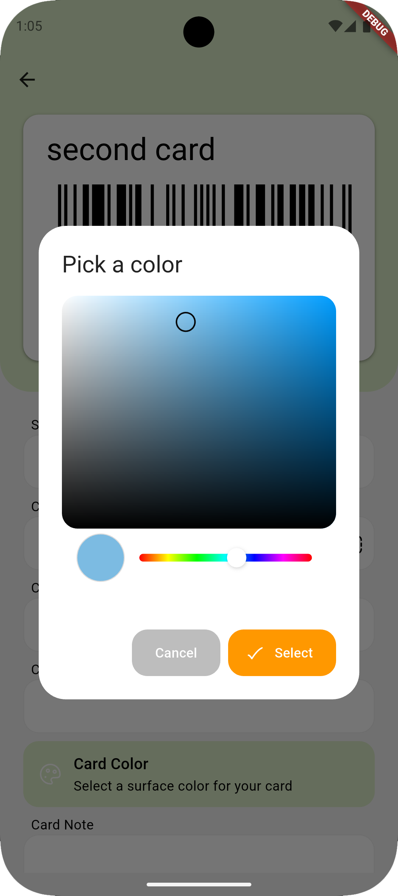
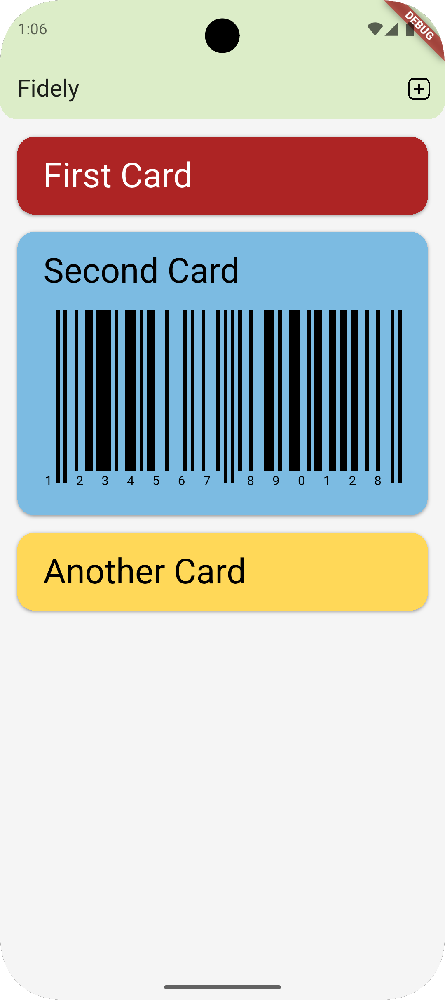

# Fidely
**Fidely is an open source, free and offline loyalty card wallet.**

## Features
- Manage your virtual wallet without any internet connection
- Scan codes via front or rear camera
- Scan codes via gallery
- Attach front and back photos to cards
- Customize cards aspect
- Dark and light modes
- Multiple codes format support (see below)
 
## Why choose Fidely?
- Free: no fees, no subscriptions
- No paid content or ads: completely free and ad-free experience
- Offline: all data is stored on your device
- Privacy first: no data shared with any third party

### Back up your device!
Your card data is stored exclusively locally on your device.  
It is recommended to regularly back up your device to prevent accidental data loss.

## Codes format support
- Code 39
- Code 93
- Code 128
- EAN 8
- EAN 13
- UPC A
- UPC E
- Aztec
- PDF 417
- QR

## Platform compatibility
Fidely is compatible with both Android and iOS devices.
- Minimum Android version: 7 (API 24)
- Minimum iOS version: 13

## Roadmap
Here are some planned features:
- [x] Dark/light mode
- [x] Barcode scanning support
- [x] Photo attachments
- [ ] Color scanning support
- [ ] Multi-language translations
- [ ] Data backup and restore
- [ ] Card sharing via custom URL scheme
- [ ] More card customization options
- [ ] Automated tests and updated status badges

If you have suggestions or requests, feel free to open an issue or contribute directly!

## License
This repository is available under the [GPL-3.0 License](./LICENSE).